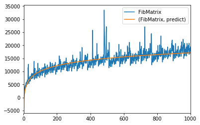

Comparison of fibonacci algorithms

Requires the following:
* tqdm
* scipy
* pandas
* numpy
* matplotlib
* standard library

These are the fibonacci algorithms contained in fibonacci.py
* FibLoop		dynamic programming
* FibRecur		brute-force recursive
* FibRecurDP	memoized recursive
* FibMatrix		matrix algorithm
* FibCassini	another matrix algorithm
* FibFormula	formulat (precision becomes an issue at x==70)

The experiment.py times each algorithm for up to 1000 (or until it times out) inputs.
It then fits a line to each of the curves and plots them using matplotlib.
This is the main program/driver code for the project. 
* TRIALS variable changes how many trials of each algorithm to run for each n.
* TIMEOUT variable changes how long each trial should be before it just goes onto next algorithm. 

Example

stopwatch.py
* the stopwatch script is used for timing the functions
* It measures times in nanoseconds

Project Status: Complete - no future work planned.